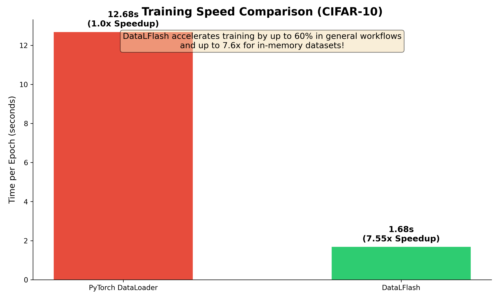

# DataLFlash ⚡

**High-Performance Data Loading for Deep Learning** / **Carga de Datos de Alto Rendimiento para Deep Learning**

[English](#english) | [Español](#español)

---

<a name="english"></a>
## 🇬🇧 English

DataLFlash is an optimized library for training Deep Learning models. It is designed to handle both massive datasets that don't fit in RAM and standard datasets with maximum efficiency.

### 📦 Installation

```bash
# Install from PyPI
pip install datalflash

# View package information
pip show datalflash

# Install from GitHub
pip install git+https://github.com/dylan-irzi/DataLFlash.git

# Or install locally (for development)
git clone https://github.com/dylan-irzi/DataLFlash.git
pip install -e .
```

### ⚡ Why DataLFlash?
- **Up to 60% Faster Training**: Optimizes the entire data loading pipeline, reducing overhead and CPU bottlenecks.
- **7.6x Speedup for In-Memory Data**: Uses zero-copy vectorization to bypass standard PyTorch DataLoader limitations.
- **Seamless Integration**: Works as a drop-in replacement for standard DataLoaders.

### 🔍 How it Works
DataLFlash rethinks data loading by:
1.  **Chunking (Disk)**: Storing data in contiguous memory-mapped chunks to minimize disk seeks.
2.  **Vectorization (Memory)**: Using direct tensor slicing instead of item-by-item iteration, removing Python loop overhead.
3.  **Background Prefetching**: Aggressively loading future batches while the GPU is busy.




### Usage Options

#### Option A: Massive Datasets (Chunking) 📦
*Best for: Datasets larger than RAM (e.g., 100GB+), optimizing I/O.*

**Step 1: Convert Dataset**
Convert your standard PyTorch dataset into optimized chunks on disk.
```pythonsi esta
from datalflash.utils import DatasetConverter

# Your original PyTorch dataset
my_dataset = ... 

DatasetConverter.create_chunked_dataset(
    pytorch_dataset=my_dataset,
    output_dir="./data_chunks",
    chunk_size=10000,
    split_ratios={'train': 0.8, 'val': 0.1, 'test': 0.1},
    shuffle=True
)
```

**Step 2: Load Dataloaders**
Automatically load train/val/test loaders. DataLFlash manages efficient background chunk loading.
```python
from datalflash.core import get_dataloaders

loaders = get_dataloaders(
    chunks_dir="./data_chunks",
    batch_size=64,
    augmentations={'train': my_train_transform}
)

train_loader = loaders['train']
```

**Step 3: Train**
Use the loader just like a standard PyTorch DataLoader.
```python
for features, targets in train_loader:
    # Training loop...
    pass
```

#### Option B: Standard Datasets (In-Memory Vectorization) ⚡
*Best for: Datasets that fit in RAM (e.g., CIFAR10, MNIST). Replaces PyTorch DataLoader for extreme speed.*

**New Feature**: DataLFlash now detects in-memory `FlashDataset` and uses **Vectorized Slicing** instead of item-by-item iteration. This bypasses the slow Python loop and `collate_fn`.

**Benchmark**: ~7.6x faster than standard PyTorch DataLoader on CIFAR-10 (Single Thread).

```python
from datalflash.core import FlashDataLoader, FlashDataset
from datalflash.utils import DatasetConverter

# 1. Convert standard dataset to FlashDataset (In-Memory)
# This creates a highly optimized memory layout (features/targets tensors)
flash_dataset = DatasetConverter.from_pytorch_dataset(
    pytorch_dataset=my_standard_dataset,
    memory_optimized=True
)

# 2. Optimized DataLoader
# Automatically uses Vectorized Slicing (C++ speed)
train_loader = FlashDataLoader(
    flash_dataset,
    batch_size=64,
    shuffle=True,
    num_workers=0, # 0 is faster because we don't need workers to read from disk!
    pin_memory=True
)

for batch in train_loader:
    # Instant batch delivery!
    ...
```

---

### 🚀 Benchmarks

| Dataset | Method | Time (Epoch) | Speedup |
| :--- | :--- | :--- | :--- |
| CIFAR-10 | PyTorch DataLoader (Standard) | 12.68s | 1x |
| CIFAR-10 | **DataLFlash (Vectorized)** | **1.68s** | **7.6x** |

---

<a name="español"></a>
## 🇪🇸 Español

DataLFlash es una librería optimizada para el entrenamiento de modelos de Deep Learning. Está diseñada para manejar tanto datasets masivos que no caben en RAM como datasets estándar con la máxima eficiencia.

### 📦 Instalación

```bash
# Instalar desde PyPI
pip install datalflash

# Ver información del paquete
pip show datalflash

# Instalar desde GitHub
pip install git+https://github.com/dylan-irzi/DataLFlash.git

# O instalar localmente (para desarrollo)
git clone https://github.com/dylan-irzi/DataLFlash.git
cd DataLFlash
pip install -e .
```

### ⚡ ¿Por qué DataLFlash?
- **Hasta 60% más rápido**: Optimiza todo el pipeline de carga de datos, reduciendo el overhead y cuellos de botella en CPU.
- **7.6x de Aceleración en Memoria**: Usa vectorización zero-copy para superar las limitaciones del DataLoader estándar.
- **Integración Sencilla**: Funciona como un reemplazo directo.

### 🔍 ¿Cómo funciona?
DataLFlash rediseña la carga de datos mediante:
1.  **Chunking (Disco)**: Almacena datos en bloques contiguos mapeados en memoria para minimizar búsquedas en disco.
2.  **Vectorización (Memoria)**: Usa slicing directo de tensores en lugar de iterar elemento por elemento.
3.  **Prefetching en Segundo Plano**: Carga agresivamente los siguientes batches mientras la GPU está ocupada.


### Opciones de Uso

#### Opción A: Datasets Masivos (Chunking) 📦
*Ideal para: Datasets más grandes que la RAM (ej. 100GB+), optimizando I/O.*

**Paso 1: Convertir Dataset**
Convierte tu dataset estándar de PyTorch en "chunks" optimizados en disco.
```python
from datalflash.utils import DatasetConverter

# Tu dataset original
my_dataset = ... 

DatasetConverter.create_chunked_dataset(
    pytorch_dataset=my_dataset,
    output_dir="./data_chunks",
    chunk_size=10000,
    split_ratios={'train': 0.8, 'val': 0.1, 'test': 0.1},
    shuffle=True
)
```

**Paso 2: Cargar Dataloaders**
Carga automáticamente los loaders de train/val/test. DataLFlash gestiona la carga eficiente en segundo plano.
```python
from datalflash.core import get_dataloaders

loaders = get_dataloaders(
    chunks_dir="./data_chunks",
    batch_size=64,
    augmentations={'train': my_train_transform}
)

train_loader = loaders['train']
```

**Paso 3: Entrenar**
Usa el loader exactamente igual que un DataLoader de PyTorch.
```python
for features, targets in train_loader:
    # Ciclo de entrenamiento...
    pass
```

#### Opción B: Datasets Estándar (Vectorización en Memoria) ⚡
*Ideal para: Datasets que caben en RAM (ej. CIFAR10, MNIST). Reemplaza al DataLoader de PyTorch para velocidad extrema.*

**Nueva Característica**: DataLFlash ahora detecta si usas un `FlashDataset` en memoria y utiliza **Slicing Vectorizado** en lugar de iterar elemento por elemento. Esto evita el bucle lento de Python y la función `collate_fn`.

**Benchmark**: ~7.6x más rápido que el DataLoader estándar de PyTorch en CIFAR-10 (Single Thread).

```python
from datalflash.core import FlashDataLoader, FlashDataset
from datalflash.utils import DatasetConverter

# 1. Convertir dataset estándar a FlashDataset (En Memoria)
# Esto crea un layout de memoria altamente optimizado (tensores features/targets)
flash_dataset = DatasetConverter.from_pytorch_dataset(
    pytorch_dataset=mi_dataset_estandar,
    memory_optimized=True
)

# 2. DataLoader Optimizado
# Usa automáticamente Slicing Vectorizado (Velocidad C++)
train_loader = FlashDataLoader(
    flash_dataset,
    batch_size=64,
    shuffle=True,
    num_workers=0, # 0 es más rápido porque no necesitamos leer de disco
    pin_memory=True
)

for batch in train_loader:
    # ¡Entrega de batch instantánea!
    ...
```

---

### 🚀 Benchmarks

| Dataset | Método | Tiempo (Epoch) | Speedup |
| :--- | :--- | :--- | :--- |
| CIFAR-10 | PyTorch DataLoader (Estándar) | 12.68s | 1x |
| CIFAR-10 | **DataLFlash (Vectorizado)** | **1.68s** | **7.6x** |

---

## 📚 API Reference / Referencia API

### `DatasetConverter.create_chunked_dataset`
| Param (Eng) | Param (Esp) | Default | Description / Descripción |
| :--- | :--- | :--- | :--- |
| `pytorch_dataset` | `pytorch_dataset` | **Req** | Source dataset / Dataset origen |
| `output_dir` | `output_dir` | **Req** | Output directory / Directorio de salida |
| `chunk_size` | `chunk_size` | `10000` | Samples per chunk / Muestras por chunk |
| `split_ratios` | `split_ratios` | `{'train': 0.8...}` | Train/Val/Test splits / Divisiones |
| `shuffle` | `shuffle` | `True` | Shuffle before chunking / Barajar antes de crear chunks |

### `FlashDataLoader`
| Param (Eng) | Param (Esp) | Default | Description / Descripción |
| :--- | :--- | :--- | :--- |
| `dataset` | `dataset` | **Req** | Dataset to load / Dataset a cargar |
| `batch_size` | `batch_size` | `1` | Batch size / Tamaño del batch |
| `shuffle` | `shuffle` | `False` | Shuffle data / Barajar datos |
| `sampler` | `sampler` | `None` | Custom sampler / Muestreo personalizado |
| `collate_fn` | `collate_fn` | `default` | Merge samples / Unir muestras |
| `drop_last` | `drop_last` | `False` | Drop incomplete batch / Descartar último batch |

## 📄 License / Licencia

This project is licensed under the MIT License - see the [LICENSE](LICENSE) file for details.

Este proyecto está bajo la Licencia MIT - mira el archivo [LICENSE](LICENSE) para más detalles.
